# Modèle de données — TOPsocietes.com

Schéma de référence de la Phase 2, stabilisé sur 26 migrations (`backend/database/migrations/2026_08_20_100001` à `100026`). Ce document remplace `docs/schema.md` (esquisse de Phase 0, conservée pour mémoire mais non tenue à jour).

**État de vérification** : ✅ complet. PostGIS a été installé sur le serveur PostgreSQL 17 local (Stack Builder) et Memurai (Redis-compatible, requis par `spatie/laravel-permission` au boot applicatif) a été installé manuellement après l'échec de l'installation automatisée. `php artisan migrate:fresh --seed` s'exécute intégralement (26 migrations + 6 seeders) et `php artisan test` passe en entier (18/18, 21 assertions, y compris les 7 tests dédiés du schéma — section 6). Pint et PHPStan niveau 6 passent sans erreur. Voir « Vérification » en fin de document.

---

## 1. Décisions structurantes

1. **Multi-pays par configuration, jamais par duplication de table/enum.** `countries` porte toute la variation nationale en JSONB (`identifier_config`, `admin_level_labels`, `url_patterns`, `source_config`). Toutes les tables métier gardent `country_id` en première colonne de leurs index composites (y compris quand il est dénormalisé depuis une relation, ex. `establishments.country_id`, `districts.country_id`). Le partitionnement par pays (option B envisagée) est différé : seuil de bascule documenté à >10M lignes sur `companies` ou VACUUM >60s, non implémenté dans cette phase.
2. **Chaîne de confiance sourcée, séparée du contenu public.** `sources → source_documents → facts (is_usable généré) → content_source_links → {city,district,activity,city_activity}_contents`. Les tables IA (`ai_prompts`, `ai_generation_jobs`, `ai_generation_logs`) sont strictement séparées, jamais lues par le front, alimentées en batch. Le générateur ne peut piocher que dans des `facts` avec `is_usable = true`.
3. **`routes` comme table centrale d'indexabilité/canonicalisation/sitemap**, plutôt que dispersée sur 8 modèles, couplée à `redirects` et aux compteurs pré-calculés (`companies_count`, `city_neighbors`, `company_nearby_pois`) : aucun calcul géographique ou de comptage coûteux à l'affichage, tout est pré-calculé par job planifié (jobs eux-mêmes hors périmètre de cette session).

---

## 2. Domaines et tables

| Domaine | Migration | Tables |
|---|---|---|
| A — Géo | `100001`–`100006` | `countries`, `admin_divisions`, `cities`, `districts`, `city_neighbors` |
| — | `100002` | Extensions Postgres (`postgis`, `pg_trgm`, `unaccent`, `btree_gin`, `citext`) + config de recherche `french_unaccent` |
| B — Nomenclatures | `100007`–`100008` | `activity_nomenclatures`, `activities`, `sectors`, `activity_sector`, `activity_mappings` |
| C — Entreprises | `100009`–`100011` | `companies`, `establishments`, `company_contacts` |
| D — POI | `100012`–`100013` | `points_of_interest`, `company_nearby_pois` |
| E — Contenus mutualisés | `100014`–`100017` | `content_sections`, `city_contents`, `district_contents`, `activity_contents`, `city_activity_contents` |
| F — Sources & faits | `100018` | `sources`, `source_documents`, `facts`, `content_source_links` |
| G — Pipeline IA | `100019` | `ai_prompts`, `ai_generation_jobs`, `ai_generation_logs` |
| H — Import | `100020` | `import_mappings`, `import_batches`, `import_errors` |
| I — SEO | `100021` | `sitemap_shards`, `routes`, `redirects`, `page_publication_rules`, `page_publication_decisions` |
| J — Comptes & monétisation | `100022`–`100023` | rôles/permissions (`spatie/laravel-permission`), `company_claims`, `plans`, `subscriptions`, `payments`, `contact_visibility_events` |
| K — Publicités & contestations | `100024` | `ad_slots`, `ad_campaigns`, `service_links`, `dispute_reports`, `dispute_events` |
| L — Exploitation | `100025`–`100026` | `activity_log` (`spatie/laravel-activitylog`), `job_runs` |

Tables standard Laravel déjà présentes depuis la Phase 0 (non listées ci-dessus) : `users`, `cache`/`cache_locks`, `jobs`/`job_batches`/`failed_jobs`.

---

## 3. Diagramme (vue d'ensemble)

Diagramme simplifié : les tables de cache dérivé (`city_neighbors`, `company_nearby_pois`), de journalisation (`ai_generation_logs`, `import_errors`, `dispute_events`, `activity_log`, `job_runs`) et de pivot pur (`activity_sector`) sont omises pour rester lisible. Le détail complet des colonnes est en section 4.

```mermaid
erDiagram
    COUNTRIES ||--o{ ADMIN_DIVISIONS : "contient"
    COUNTRIES ||--o{ CITIES : "contient"
    COUNTRIES ||--o{ COMPANIES : "scope"
    ADMIN_DIVISIONS ||--o{ ADMIN_DIVISIONS : "parent/enfant"
    ADMIN_DIVISIONS ||--o{ CITIES : "contient"
    CITIES ||--o{ DISTRICTS : "contient"

    ACTIVITY_NOMENCLATURES ||--o{ ACTIVITIES : "définit"
    ACTIVITIES ||--o{ ACTIVITIES : "parent/enfant"
    ACTIVITIES }o--o{ SECTORS : "regroupe"

    COMPANIES }o--|| COUNTRIES : "appartient"
    COMPANIES }o--o| ACTIVITIES : "classée"
    COMPANIES }o--o| CITIES : "localisée"
    COMPANIES }o--o| DISTRICTS : "localisée"
    COMPANIES ||--o{ ESTABLISHMENTS : "possède"
    COMPANIES ||--o{ COMPANY_CONTACTS : "masque"
    COMPANIES ||--o{ COMPANY_CLAIMS : "revendiquée par"
    COMPANIES ||--o{ SUBSCRIPTIONS : "démasque via"
    COMPANIES ||--o{ DISPUTE_REPORTS : "contestée"

    POINTS_OF_INTEREST }o--o| CITIES : "situé"
    COMPANIES ||--o{ COMPANY_NEARBY_POIS : "à proximité de"
    POINTS_OF_INTEREST ||--o{ COMPANY_NEARBY_POIS : "référencé par"

    CITIES ||--o{ CITY_CONTENTS : "contenu"
    DISTRICTS ||--o{ DISTRICT_CONTENTS : "contenu"
    ACTIVITIES ||--o{ ACTIVITY_CONTENTS : "contenu (xor secteur)"
    SECTORS ||--o{ ACTIVITY_CONTENTS : "contenu (xor activité)"
    CITIES ||--o{ CITY_ACTIVITY_CONTENTS : "contenu croisé"
    ACTIVITIES ||--o{ CITY_ACTIVITY_CONTENTS : "contenu croisé (xor secteur)"

    SOURCES ||--o{ SOURCE_DOCUMENTS : "fournit"
    SOURCES ||--o{ FACTS : "justifie"
    FACTS ||--o{ CONTENT_SOURCE_LINKS : "trace"

    AI_PROMPTS ||--o{ AI_GENERATION_JOBS : "utilisé par"
    AI_GENERATION_JOBS ||--o{ CITY_CONTENTS : "génère"
    AI_GENERATION_JOBS ||--o{ COMPANIES : "génère à propos"

    IMPORT_MAPPINGS ||--o{ IMPORT_BATCHES : "configure"
    IMPORT_BATCHES ||--o{ COMPANIES : "source de"

    ROUTES ||--o{ PAGE_PUBLICATION_DECISIONS : "évaluée par"
    ROUTES }o--o| SITEMAP_SHARDS : "regroupée dans"
    ROUTES ||--o{ ROUTES : "canonique de"

    PLANS ||--o{ SUBSCRIPTIONS : "souscrit"
    SUBSCRIPTIONS ||--o{ PAYMENTS : "règle"
    SUBSCRIPTIONS ||--o{ CONTACT_VISIBILITY_EVENTS : "déclenche"

    AD_SLOTS ||--o{ AD_CAMPAIGNS : "diffuse"
```



---

## 4. Décisions et hypothèses documentées

Consolidation de toutes les décisions non triviales prises pendant l'implémentation, domaine par domaine.

### A — Géo
- `admin_divisions.path` : `varchar` matérialisé (ex. `"1.12.69"`) plutôt que `ltree`. `ltree` est disponible sur le serveur local mais absent de la liste des extensions sanctionnées par le prompt (§3.4) ; facilement basculable si besoin futur.
- `districts.boundary` reste nullable : le rattachement automatique d'une entreprise à son quartier par `ST_Contains` est un traitement de Phase 4 (résolution géo), hors périmètre schéma.

### B — Nomenclatures
- `sectors` est un regroupement éditorial transversal indépendant des codes nationaux, condition nécessaire pour générer un contenu métier unique partagé entre pays malgré des nomenclatures différentes (NAF/NACEBEL/SCIAN/…).
- `activity_mappings.confidence` : `CHECK (confidence BETWEEN 0 AND 100)`, seuil d'utilisation applicative non fixé ici (dépend du pipeline de correspondance, hors périmètre).

### C — Entreprises
- `companies.about_text` + `about_generation_id` directement sur `companies`, plutôt qu'une table `company_generated_blocks` dédiée — le prompt laissait le choix ouvert, la solution la plus simple suffit.
- `establishments.national_id` : `unique(country_id, national_id)`, par symétrie avec `companies`, pour une clé de rapprochement identique à l'import.
- Interdiction structurelle : aucune table de contenu éditorial propre à une entreprise (histoire/tourisme/culture ne sont jamais des contenus d'entreprise, CLAUDE.md §6.2) — seul `about_text` (généré depuis les données de la fiche elle-même) existe sur `companies`.

### D — POI
- `company_nearby_pois` est un cache pur (FK en cascade), jamais recalculé à l'affichage — alimenté par job planifié, `distance_m` toujours issu de `ST_Distance`.

### E — Contenus mutualisés
- **Correctif d'unicité XOR** (`activity_contents`, `city_activity_contents`) : le prompt donnait une contrainte `unique(sujet, locale, section)` classique, mais `activity_id`/`sector_id` sont mutuellement exclusifs et Postgres ne considère jamais deux `NULL` comme égaux dans un `UNIQUE` standard — deux doublons côté secteur passeraient inaperçus. Résolu par deux index `UNIQUE` partiels par table (un par branche du XOR), avec `COALESCE(country_id, 0)` sur `activity_contents` pour dédupliquer aussi le contenu générique (tous pays).
- `content_sections.key` est unique globalement. La section `faq`, partagée par `activity_contents` et `city_activity_contents`, n'a donc qu'**une seule** ligne de configuration (`scope = activity`) — le rattachement réel se fait par la valeur de `section` sur chaque table de contenu, pas par ce `scope` informatif. Documenté dans `ContentSectionSeeder`.

### F — Sources & faits
- Seuil `facts.is_usable` (colonne générée `STORED`) : `confidence_score >= 60 AND corroboration_count >= 1`. Aucune valeur n'était donnée dans le prompt — **hypothèse à valider avant mise en production** ; la modifier nécessite une migration (colonne générée).

### G — Pipeline IA
- Aucune règle propre ; ferme les 5 références en avant laissées par les Domaines C et E (`companies.about_generation_id` + les 4 colonnes `generation_id` des tables de contenu) en `nullOnDelete()` : la suppression d'un job de génération ne doit jamais supprimer le contenu déjà publié, seulement le lien de traçabilité.

### H — Import
- `import_batches.checkpoint` (jsonb) porte l'offset de reprise ; `import_errors` permet de ne relancer que les lignes en échec, jamais tout le lot.

### I — SEO
- `routes.entity_type`/`entity_id` nullables : pour les pages combinatoires activité × territoire (`activity_city`, `sector_geo`), le prompt ne définit pas de table "page combinatoire" dédiée — la ligne `routes` + sa `page_publication_decision` restent la source de vérité même sans entité concrète rattachée.
- Détection et aplatissement des chaînes/boucles de redirection : règle métier explicitement exigée par le prompt, non exprimable en contrainte SQL (nécessiterait de suivre une chaîne arbitraire) — à implémenter comme Action lors de l'écriture d'une nouvelle redirection (Phase 10), pas dans cette migration.
- `page_publication_rules` : même correctif d'index partiels que le Domaine E pour gérer `country_id` nullable (règle globale par défaut vs règle par pays) sans UNIQUE composite inefficace face aux NULL.

### J — Comptes & monétisation
- `payments` ne stocke jamais de donnée bancaire : uniquement les références du prestataire (`provider_payment_id`) et son `payload` brut (déjà expurgé côté prestataire).
- FK par défaut en `restrict`, sauf liste explicite du prompt (§5.6) — ex. `page_publication_decisions.route_id` traité comme historique d'audit à préserver, par analogie avec `content_source_links`.

### K — Publicités & contestations
- `dispute_reports.status` inclut la valeur `'new'`, mais `New` est un mot-clé réservé PHP (insensible à la casse) et ne peut pas être un nom de cas d'enum — le cas est nommé `Submitted` avec la valeur `'new'` (voir docblock de `App\Enums\DisputeStatus`).
- `dispute_reports.ip_hash` : jamais l'IP en clair, seulement son hash SHA-256 — anti-abus sans donnée personnelle brute conservée.
- `ad_slots` seedés : 2 emplacements desktop (rail droit sticky) + 2 emplacements mobiles repositionnés après les blocs Contact et Quartier (mobile n'a pas de rail latéral, CLAUDE.md §5.4).

### L — Exploitation
- `job_runs` est un historique durable et interrogeable (back-office Filament), distinct de `jobs`/`failed_jobs` (file d'attente Laravel, éphémère) — colonnes non spécifiées explicitement dans le prompt d'origine, conçues par analogie avec `import_batches` (statut, tentatives, timing, payload/sortie jsonb).
- Les 3 migrations stub publiées par `spatie/laravel-activitylog` sont consolidées en une seule migration, pour respecter la convention du projet (une table = une migration).

### Autres
- `PageRoute` : le modèle Eloquent de la table `routes` est nommé `PageRoute` (et non `Route`) pour éviter toute collision avec la façade de routing Laravel `Illuminate\Support\Facades\Route`.
- La carte polymorphique (`Relation::enforceMorphMap`, `AppServiceProvider::boot()`) inclut `'user' => User::class` : `spatie/laravel-permission` rattache les rôles via une relation `MorphToMany` (`model_has_roles`), qui échoue sous `enforceMorphMap()` si le modèle concerné n'y figure pas — découvert au premier `migrate:fresh --seed` complet, via l'échec de `$admin->assignRole()` dans `DatabaseSeeder`.
- Regex de `countries.identifier_config` (SIREN/SIRET, BCE, MF, ICE, NIF, NEQ) : valeurs de référence saisies pour le seeder, **à faire valider par un expert-comptable local par pays avant mise en production**.
- Nomenclature NAF Rev. 2 seedée (`NafNomenclatureSeeder`) : 21 sections + 88 divisions, libellés reproduits depuis la nomenclature publique INSEE — à recouper avec le fichier officiel avant tout usage en production. Les niveaux plus fins (groupe/classe/sous-classe) sont du ressort du pipeline d'import (Domaine H), pas de ce seeder.

---

## 5. Règles de clé étrangère

Par défaut : `restrictOnDelete()`. Cascade (`cascadeOnDelete()`) uniquement sur les tables explicitement listées par le prompt (§5.6) — établissements et contacts d'une entreprise supprimée, erreurs d'un batch d'import supprimé, logs d'un job de génération supprimé, événements d'une contestation supprimée, et les tables de cache pur dérivé (`city_neighbors`, `company_nearby_pois`). `nullOnDelete()` sur les liens de traçabilité qui ne doivent jamais entraîner la suppression du contenu qu'ils documentent (toutes les colonnes `generation_id`, `canonical_route_id`, `sitemap_shard_id`, `assigned_to`, `reviewed_by`).

---

## 6. Tests (Pest)

`backend/tests/Feature/Database/`, exécutés contre une base PostgreSQL dédiée (`topsocietes_test`, configurée via `.env.testing` + `phpunit.xml`, jamais SQLite — le schéma dépend de PostGIS/jsonb/citext/tsvector, indisponibles sous SQLite) :

| Fichier | Couvre |
|---|---|
| `CompanyNationalIdUniquenessTest` | rejet d'un `national_id` dupliqué dans le même pays, autorisé entre deux pays |
| `GeoWithinRadiusTest` | `ST_DWithin` (scope `withinRadius`) filtre bien par distance réelle |
| `GeoDistanceAccuracyTest` | `ST_Distance` renvoie une distance géodésique cohérente ; `orderByDistanceFrom` trie du plus proche au plus loin |
| `ContactHiddenByDefaultTest` | un contact inséré sans `visibility` explicite est `hidden` par défaut, au niveau colonne |
| `ActivityContentXorConstraintTest` | la contrainte `CHECK` XOR (`activity_id` / `sector_id`) rejette 0 et 2 valeurs simultanées |
| `CityActivityContentUniquenessTest` | les deux index `UNIQUE` partiels empêchent les doublons côté activité et côté secteur |
| `FullTextSearchAccentTest` | la config `french_unaccent` retrouve un nom accentué via une requête sans accent / en majuscules |

Ces 7 fichiers (16 assertions) passent intégralement, avec l'ensemble de la suite (`php artisan test`, 18 tests, 21 assertions).

---

## 7. Vérification

```bash
cd backend
vendor/bin/pint --test
vendor/bin/phpstan analyse --memory-limit=512M   # niveau 6, 0 erreur sur l'ensemble du schéma
php artisan migrate:fresh --seed                  # ✅ 26 migrations + 6 seeders
php artisan test                                  # ✅ 18 passed (21 assertions)
```

Prérequis locaux (Windows) : PostGIS installé via Stack Builder (`bin/StackBuilder.exe`, catégorie *Spatial Extensions*) ; Memurai (compatible Redis, `CACHE_STORE=redis`) installé et démarré comme service — `spatie/laravel-permission` sollicite le cache au boot de l'application, y compris pendant les migrations/seeders.

---

## 8. Recherche (Phase 14)

`App\Domain\Search\Contracts\SearchEngineInterface`, lié à `PostgresSearchEngine` dans `AppServiceProvider::register()` (ADR 0001) — même patron que `CheckoutGatewayInterface`/`AiDriver`. **Meilisearch est explicitement hors périmètre** (CLAUDE.md §9 : accord requis avant tout nouveau service externe ; le tableau de stack ne rend obligatoire que "PostgreSQL FTS derrière `SearchEngineInterface`").

- **Terme numérique** (`^\d+$`) → recherche SIREN exacte/préfixe sur `national_id`, jamais floue.
- **Terme texte** → `tsvector`/`french_unaccent` (rapide, radical) combiné à un repli `pg_trgm` pour la tolérance aux fautes de frappe — l'équivalent Postgres-only de ce qu'apporterait Meilisearch, classé par `GREATEST(ts_rank_cd(...), similarity(...))`. **Piège pg_trgm** : `gin_companies_name_trgm` n'est utilisable que par l'opérateur `%` (ou `<->`) — un appel de fonction `similarity(a, b) > seuil` en `WHERE` n'est jamais indexable, même si l'index existe (confirmé par `EXPLAIN` : `Seq Scan` forcé même avec `enable_seqscan = off`). Le `WHERE` utilise donc `legal_name % ?`, le seuil étant fixé par `SET pg_trgm.similarity_threshold` en session ; `similarity()` reste utilisé dans le `SELECT` uniquement, pour classer les lignes déjà trouvées.
- **Filtres combinables** : ville/code postal (slug ville, `? = ANY(postal_codes)` — index GIN dédié posé par cette phase, `cities.postal_codes` n'en avait aucun), activité (slug), secteur (via `activity.sectors`), département/région (`admin_division_id` = la division ou l'un de ses enfants directs — hiérarchie à 2 niveaux, `admin_divisions.path` existe en colonne mais n'est peuplé par aucun code, volontairement pas utilisé).
- **Pagination keyset** (`cursorPaginate()` natif Laravel, jamais d'OFFSET) : sans terme, tri direct sur `legal_name`/`id`. Avec un terme, le rang de pertinence est un alias de `SELECT` — invalide dans le `WHERE` que le curseur génère pour la page suivante. Contournement via `fromSub()` : la requête classée devient une sous-requête, le rang y devient une vraie colonne de la requête externe, donc utilisable par le curseur.
- **Réindexation/fallback** : sans second moteur, ces deux préoccupations de la carte Trello sont satisfaites par construction — `search_vector` est une colonne générée **STORED**, toujours à jour à l'écriture ; il n'y a rien vers quoi retomber puisqu'un seul moteur existe.

Tests : `backend/tests/Feature/Search/PostgresSearchEngineTest.php` (filtres isolés/combinés, faute de frappe, SIREN, pagination sur 2 pages sans doublon ni trou — avec et sans terme de recherche).
