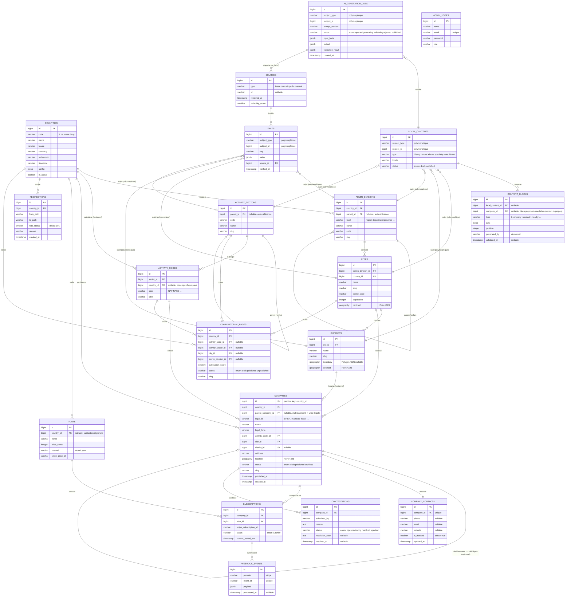

# Modèle de données — TOPsocietes.com

Ce document précède toute migration (Phase 0). Il couvre l'ensemble du modèle nécessaire aux phases 1 à 13 pour éviter des migrations contradictoires plus tard. Chaque groupe de tables correspond à une phase du plan ; le détail exact des colonnes (types, index, contraintes) sera affiné au moment de la migration de la phase concernée, mais les relations et clés étrangères ci-dessous sont considérées stables.

## Notes de conception ouvertes

- **`companies` / unité légale vs établissement** (décision client en attente n°2) : le schéma ne préjuge pas de la réponse. `companies` porte une colonne `parent_company_id` (nullable, auto-référence) qui permet de modéliser un établissement rattaché à une unité légale sans réécriture de table si la décision tranche pour le multi-niveau. Si la décision retient "un seul niveau", cette colonne reste simplement inutilisée.
- **`countries.code`** (décision client en attente n°1, sous-domaine Algérie) : `code` est un simple `varchar` contraint par une table de configuration, jamais codé en dur dans l'application — aucun impact sur le schéma.
- Toutes les tables volumineuses (`companies`, `facts`, `content_blocks`, `combinatorial_pages`) sont conçues pour un accès par curseur (`cursor()`/`lazy()`), jamais `all()`/`get()`.
- `facts` et `local_contents` utilisent une relation polymorphique (`subject_type` + `subject_id`) car un contenu local peut être rattaché à une ville, un quartier, une division administrative ou un secteur — jamais à une entreprise (règle métier gravée n°2).

## Diagramme

## Correspondance phases → tables

| Phase | Tables |
|---|---|
| 1 — Socle référentiel | `countries`, `admin_divisions`, `cities`, `districts`, `activity_sectors`, `activity_codes` |
| 2 — Entreprises & PostGIS | `companies`, `company_contacts` |
| 3 — Pipeline d'import | pas de nouvelle table de domaine ; journalisation dans `Support` (hors Domain) |
| 4 — Résolution géo | pas de nouvelle table ; peuple `companies.district_id` et pré-calcule la proximité |
| 5 — Contenus mutualisés | `sources`, `facts`, `local_contents`, `content_blocks` |
| 6 — Chaîne IA | `ai_generation_jobs` |
| 10 — SEO | `redirections` |
| 11 — Pages combinatoires | `combinatorial_pages` |
| 12 — Monétisation | `plans`, `subscriptions`, `webhook_events` |
| 13 — Back-office | `admin_users`, + ressources Filament sur les tables existantes ; `contestations` |
